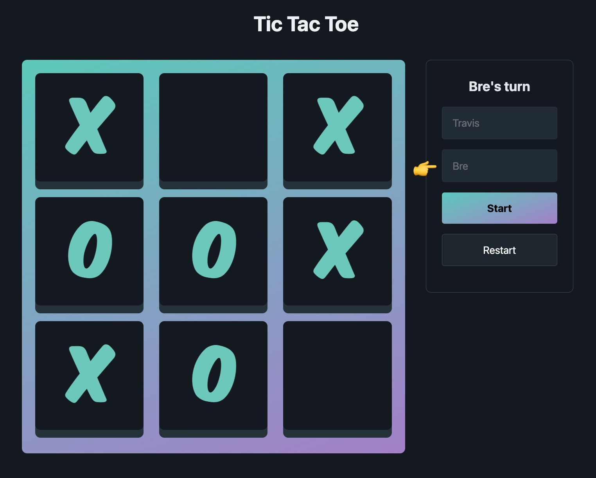

# Screenshot

# Program Details
- Tic Tac Toe Game with "AI"
- Functional programming practice project. 

# Todo List
- [X] Set players, name, marker, active

- [X] Board controller 
    - [X] togglePlayer func
    - [X] IF square clicked add marker to square
    - [X] checkWinner func - winner loops through squares and matches up with winner array
    - [X] disableSquare func
- [X] DisplayController
    - [X] declareWinner
    - [X] declaireTie

- [X] Reset game function
    - [X] Reset button

- [X] start game function
    - [X] Sart button
- [X] Refactor checkWinner function
- [ ] Add AI
- [ ] Fix mobile responsive
- [ ] Refactor

